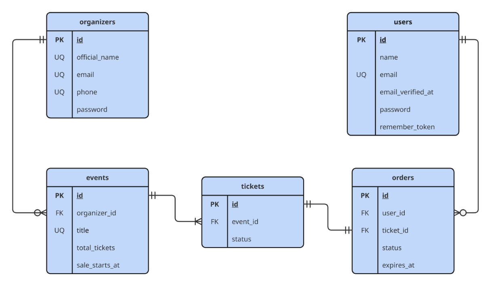
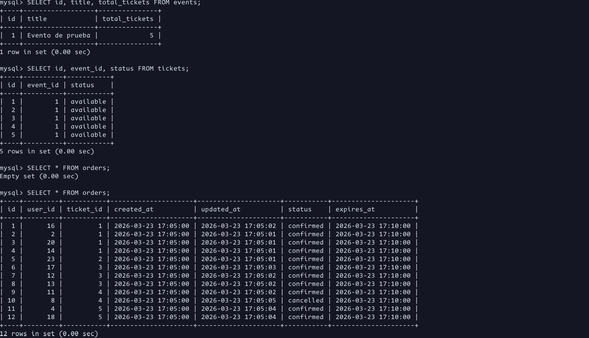
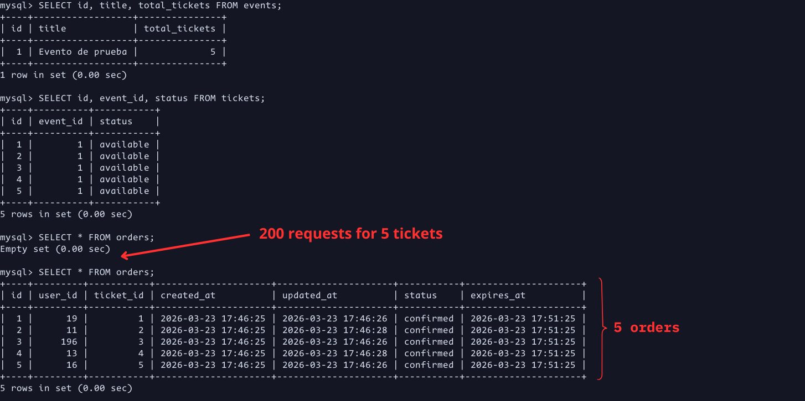

<br>

## The problem: 1,200 Tickets for 1,000 Seats

Imagine this: It's 8:00 PM, Red Bull just dropped tickets for the most prestigious freestyle rap battle competition in the world. One thousand seats. Fifteen thousand people hitting "Buy" at the exact same moment.

Every single one of them gets the same answer from the database: yes, there's a ticket available. The API sells 1,000 tickets — and then keeps going. 1,100. 1,200. Seats that don't exist. This is a race condition — a bug that never shows up in development, only when thousands of real users are fighting over a scarce resource at the same time. This is the story of how I built a ticket sales API from scratch to survive that moment.

## The Project

Flash Sales is a REST API built with Laravel designed to handle high-demand ticket sales — the kind where thousands of users compete for a limited resource in a matter of seconds. I built it entirely from scratch as a self-taught project: database design, business logic, and concurrency handling, all on my own.

I'm a telecommunications engineering student with a passion for backend development, and this project taught me more about real-world engineering than any lecture ever has. The full source code is available on [GitHub](https://github.com/ivan-amon/flash-sales).

## Designing the Database

The schema is simple but effective: `organizers`, `events`, `tickets`, `orders`, and `users`. No over-engineering — just enough structure to model the problem correctly.

The key decision is in the `tickets` table. Each ticket is its own row with a status field rather than a simple counter on events. You can't lock a counter. You can lock a row.



<br>

## The Solution

### Seeing the Problem in Action

Without any concurrency protection, and just a bare CRUD, the results speak for themselves. In this test, 200 simultaneous requests fired against the same endpoint using Apache JMeter — yes, it looks like it's from 2003, but it gets the job done. The database doesn't lie, 12 orders for 5 tickets:



<br>

### My Approach

The solution works in two layers. Layer 1 uses Redis to filter the overwhelming majority of requests before they ever reach the database. Layer 2 applies pessimistic locking at the MySQL level — not because Redis isn't enough, but because in systems where data integrity is critical, you don't rely on a single line of defense. This is the principle of defense in depth.

### Layer 1: Redis Backpressure

The first layer uses Redis to reject the vast majority of requests before they ever touch MySQL.

Redis is single-threaded and processes commands through an event loop — which means operations like `INCR` and `DECR` are atomic by design. There are no race conditions at this level. No two requests can read and modify the same key simultaneously.

The logic is simple: when a request comes in, we decrement a counter in Redis. If the result drops below zero, there are no tickets left — reject immediately and increment back. Only the requests that pass this check are allowed through to the database.

```php
$key = "available_tickets_{$event->id}";
Redis::setnx($key, $event->tickets()->where('status', TicketStatus::Available)->count());

$remaining = Redis::decr($key);
if ($remaining < 0) {
    Redis::incr($key);
    throw new NotAvailableTicketsException("No available tickets for event {$event->id}.");
}
```

<br>

### Layer 2: Pessimistic Locking

The second layer is where MySQL takes over. Even though Redis has already filtered out most of the traffic, we wrap the ticket reservation in a database transaction with pessimistic locking.

`lockForUpdate()` tells MySQL to acquire an exclusive lock on the selected row. Any other transaction trying to read that same row will be blocked until the first one completes — making it physically impossible for two requests to reserve the same ticket simultaneously.

This layer is lightweight in practice because Redis has already done the heavy lifting. But it's here because it has to be.


```php
$ticket = DB::transaction(function () use ($event, $key) {
    $ticket = $event->tickets()
        ->where('status', TicketStatus::Available)
        ->lockForUpdate()
        ->first();

    if (!$ticket) {
        Redis::incr($key);
        throw new NotAvailableTicketsException("No available tickets for event {$event->id}.");
    }

    $ticket->status = TicketStatus::Reserved;
    $ticket->save();

    return $ticket;
});
```

<br>

**Why not just pessimistic locking alone?** Because under 10,000 simultaneous requests, every single one would open a transaction and queue up waiting for the lock to be released. MySQL would be holding thousands of open connections, memory would spike, and the database would become the bottleneck — or simply crash. Redis acts as a bouncer: cheap, fast, and atomic. By the time a request reaches MySQL, the crowd has already been turned away at the door.

### The Evidence

Same test, same conditions — this time with the two-layer solution in place. 200 concurrent requests, 5 tickets available. The database doesn't lie. 5 orders. 5 tickets. One each:



<br>

## Lessons Learned

Building **Flash Sales** taught me two things that no lecture ever could.

The first is how elegantly Laravel abstracts genuinely complex problems. `lockForUpdate()` is one method. `DB::transaction()` is one wrapper. The Redis Facade makes interacting with Redis feel like calling a local function. Behind all of them lies decades of theory — but Laravel makes it feel simple. That's powerful.

The second is the danger of that simplicity. Laravel is easy enough that everything works — and that's exactly the trap. Bloated controllers, business logic leaking everywhere, no separation of concerns. It functions, but it doesn't scale. This project pushed me to think beyond "does it work" and start asking "does it hold up under pressure."

There's still work to do. The most obvious next step is integrating real payments with Stripe — right now orders are reserved but never actually charged. That's a whole new layer of complexity: webhooks, payment confirmation, and keeping the ticket status in sync with the payment state.

---
<br> 

*If you made it this far, I hope it was worth your time. If you found it useful, sharing it would mean a lot — it's my first post, and every reader counts ❤️*


