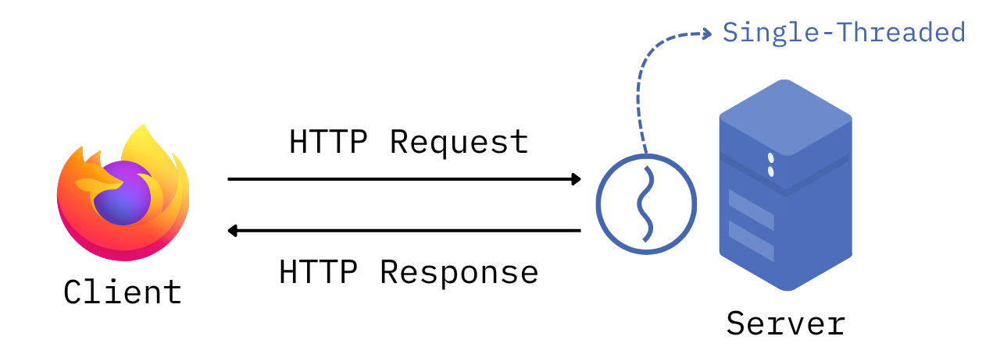
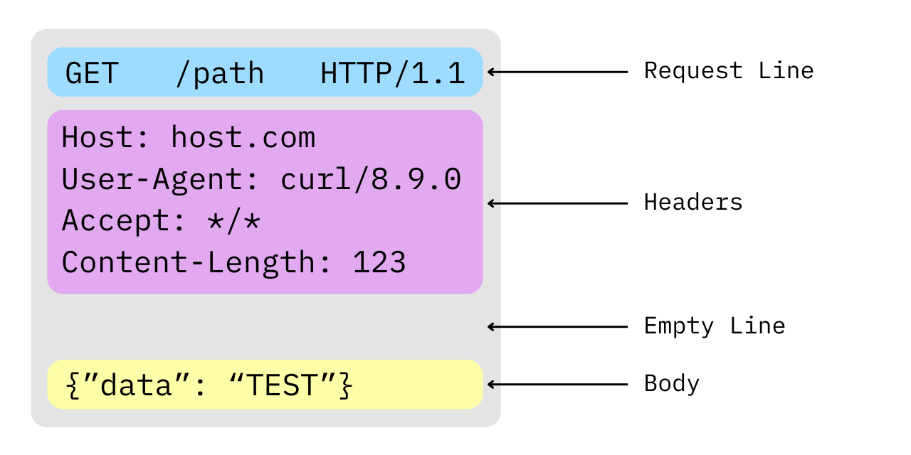
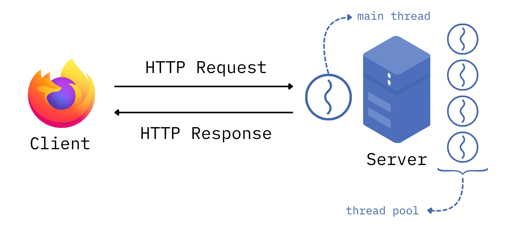

<br>

## Introduction

Continuing my journey into systems programming with **Rust**, I decided to tackle the capstone project from *The Rust Programming Language*: building a multithreaded 
HTTP server from scratch using nothing but the standard library `std`. No heavy frameworks like Actix-web or Axum, and absolutely no external crates. The goal? To truly 
understand low-level network programming, efficiently handle concurrent requests by implementing a **Thread Pool**, and finally write idiomatic Rust without constantly 
fighting the borrow checker. Let's dive into the technical breakdown!

<hr>
<br>

## Single-Threaded HTTP Server

Before we tackle the complexities of concurrency and thread pools, we need to lay the groundwork. Our first milestone is to build a fully functional, 
single-threaded server capable of crafting a valid HTTP response for a standard `GET` request. I've included a diagram of our single-threaded architecture
below:



<br>

### Establishing Connections with TcpListener

First things first, we need our server to listen for incoming connections on a specific port. Rust's `std` library provides a very powerful API for this 
purpose: `TcpListener`. By using `TcpListener`, we can leverage the Operating System to abstract away the underlying transport layer logic. This allows 
us to easily obtain a `TcpStream`, which we can then use to read the encapsulated data from the application layer (HTTP). Here is an example:

```rust
let listener = TcpListener::bind("127.0.0.1:7878").unwrap();

for stream in listener.incoming() {
    let stream = stream.unwrap();
    println!("Connection established!");
}
```

<br>

### Parsing HTTP Requests


With the connection established, our next task is to process the incoming data stream. It is crucial to remember that, at the transport layer, a stream 
is merely a sequence of raw bytes—the server has no semantic understanding of this data until it parses it. While this stream could theoretically contain 
arbitrary data, our server is explicitly designed to interpret these bytes according to the HTTP protocol. Therefore, our next step is to parse this raw 
byte stream into meaningful client requests.

Before we write any parsing logic, we must understand the anatomy of an HTTP request. Visualizing it makes things much clearer:



As we can see, a request consists of a **Request Line**, **Headers**, an **Empty Line**, and a **Body**. Let's focus on the most critical component for 
routing: the  **Request Line**. To keep the initial version of our server straightforward, we will assume it only handles `GET` requests to the root path 
`/` using the `HTTP/1.1` protocol version.

```rust
fn handle_connection(mut stream: TcpStream) {
    // Getting the Request Line
    let buf_reader = BufReader::new(&stream);
    let request_line = buf_reader.lines().next().unwrap().unwrap();

    match &request_line[..] {
        "GET / HTTP/1.1" => println!("Valid request.");
        _ => println!("Invalid request.");
    };
}
```

<br>

### Making an HTTP Response

Finally, with the client's request successfully parsed, we must serve an appropriate HTTP Response. The anatomy of an HTTP Response closely mirrors that of a Request, with one key distinction: the initial line is known as the Status Line rather than the Request Line. Instead of a routing path, it contains an HTTP status code, such as the ubiquitous `200 OK` or the infamous `404 Not Found`.

Our routing logic will be straightforward: if the client requests the valid root path, we will return a `200 OK` status along with our main HTML page. For any other route, we will gracefully handle the error by serving a `404 Not Found` status alongside a custom error HTML page.

```rust
fn handle_connection(mut stream: TcpStream) {
    // --snip--
    // Parsing and validating HTTP Request
    let (status_line, filename) = match &request_line[..] {
        "GET / HTTP/1.1" => ("HTTP/1.1 200 OK", "hello.html"),
        _ => ("HTTP/1.1 404 NOT FOUND", "404.html"),
    };
    let contents = fs::read_to_string(filename).unwrap();
    let length = contents.len();

    // Making our HTTP Response
    let response =
        format!("{status_line}\r\nContent-Length: {length}\r\n\r\n{contents}");

    // Sending our HTTP Response
    stream.write_all(response.as_bytes()).unwrap();
}
```
<br>

Now that we have a foundational HTTP server successfully responding to our requests, it's time to level up our architecture. To handle multiple requests concurrently and prevent a single slow connection from blocking the entire server, we are going to implement a **Thread Pool**.

<hr>
<br>

## Multithreaded HTTP Server

Here is the core concept behind our Thread Pool: the main thread acts as a dispatcher, dedicated solely to listening for incoming connections. When a request arrives, it is handed off to an available worker thread. If all threads in the pool are currently busy processing, incoming requests are placed into a queue. As soon as a worker finishes its current job, it polls the queue and picks up the next pending request.

To help visualize this concurrent workflow, I've included a diagram of our new multithreaded architecture below:



<br>

### Implementing a Threadpool

Unlike some other languages, Rust’s standard library intentionally omits a built-in `Thread Pool`, which means we get to roll our own! To keep this breakdown digestible and avoid turning it into a two-hour read, I won't do a deep dive into the internal mechanics of our custom ThreadPool struct. However, if you are curious about the low-level implementation details, you can find the full source code on my GitHub.

From the outside, our new `ThreadPool` exposes a clean and ergonomic API that allows us to:
- Instantiate the pool using `ThreadPool::new(size)`, giving us full control over the number of active worker threads.
- Submit tasks using the `.execute()` method, which accepts closures and dispatches them to the available workers.

Under the hood, our implementation orchestrates standard library concurrency primitives—namely, `mpsc` (Multi-Producer, Single-Consumer) channels for message passing, alongside 
`Arc` and `Mutex` for safe shared state. Together, these guarantee thread-safe task distribution without any data races. In the `main` function, leveraging our new API is remarkably straightforward:

```rust
fn main() {
    let addr = format!("127.0.0.1:7878"); // localhost
    let listener = TcpListener::bind(addr).unwrap();
    let pool = ThreadPool::new(4); 

    for stream in listener.incoming() {
        let stream = stream.unwrap();
        
        pool.execute(|| {
            handle_connection(stream);
        });
    }
}
```

<br>

And just like that, we have a multithreaded HTTP server running seamlessly!

<hr>
<br>

## What's next?

Getting to this point was no easy feat. It involved countless hours of wrestling with the borrow checker, wrapping my head around memory references, and deciphering lifetime rules. However, seeing this capstone project through to the end has undeniably made me a better software engineer overall, not just a better Rust developer.

So, what's next? The goal now is to take this foundational server and evolve it into a production-ready application. I plan to enhance the architecture by implementing robust error handling and a more sophisticated routing system. Ultimately, I want to deploy this server to the real world, which will serve as the perfect stepping stone to dive deep into CI/CD pipelines and deployment automation.

[GitHub Repo](https://github.com/ivan-amon/rust-http-server)

---
<br>

*If you made it this far, I hope it was worth your time. If you found it useful, sharing it would mean a lot and every reader counts ❤️*